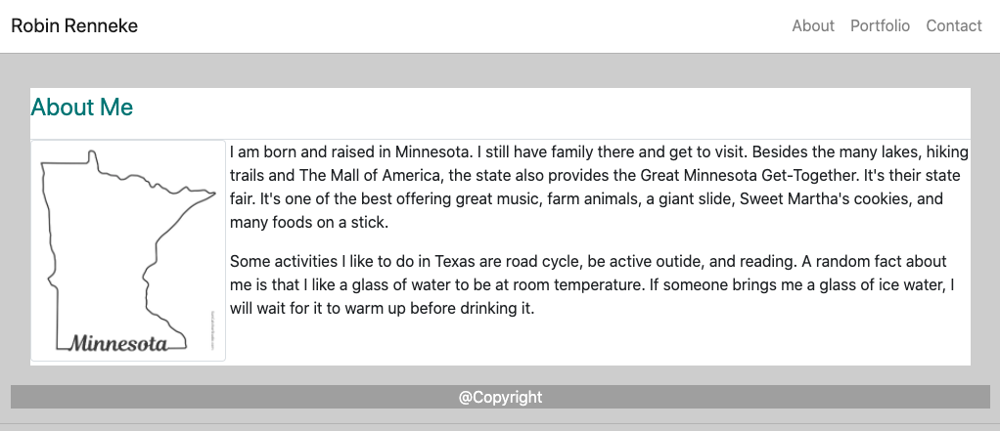
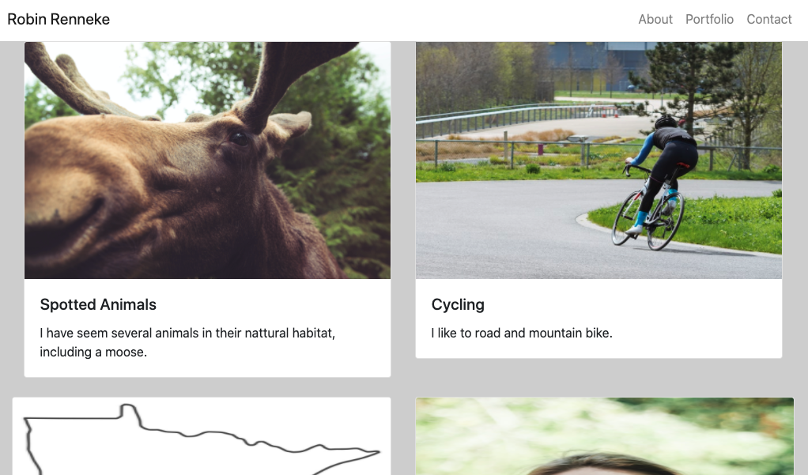
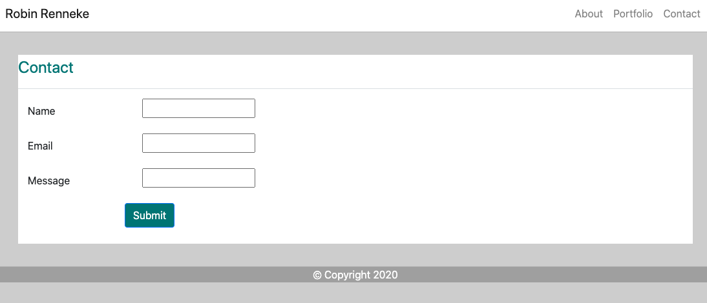

In this project, three HTML pages were created to make a responsive portfolio. 

1. An index page about myself

  

2. A portfolio page about the projects I have done. Since this is only my second project, there are placeholders with images and a description. 

  

3. A contact page with a way to contact me. 

  

Bootstrap was used to create a navigation bar, incorporate a responsive layout, and for responsive images. The sites minimize to the use of media queries and utilizes containers and rows. 

Links: 

https://github.com/RRenneke/Responsive-Portfolio

https://rrenneke.github.io/Responsive-Portfolio/